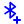
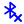

# Full Icon Catalog - Page 13

[<< Previous](ALL_ICONS_12.md) | Page 13 of 40 | [Next >>](ALL_ICONS_14.md)

| Name | Dark Mode | Light Mode | Red | Green | Blue | Orange | Pink | Gold | Yellow | Gray | Light Blue | Light Red | Light Green | Light Pink |
| :--- | :---: | :---: | :---: | :---: | :---: | :---: | :---: | :---: | :---: | :---: | :---: | :---: | :---: | :---: |
| `bird` |  |  |  |  |  |  |  |  |  |  |  |  |  |  |
| `birdhouse` |  |  |  |  |  |  |  |  |  |  |  |  |  |  |
| `bitcoin` |  |  |  |  |  |  |  |  |  |  |  |  |  |  |
| `blend` |  |  |  |  |  |  |  |  |  |  |  |  |  |  |
| `blender` |  |  |  |  |  |  |  |  |  |  |  |  |  |  |
| `blinds` |  |  |  |  |  |  |  |  |  |  |  |  |  |  |
| `blocks` |  |  |  |  |  |  |  |  |  |  |  |  |  |  |
| `bluetooth-check` |  |  |  |  |  |  |  |  |  |  |  |  |  |  |
| `bluetooth-circle` |  |  |  |  |  |  |  |  |  |  |  |  |  |  |
| `bluetooth-connected` |  |  |  |  |  |  |  |  |  |  |  |  |  |  |
| `bluetooth-minus` |  |  |  |  |  |  |  |  |  |  |  |  |  |  |
| `bluetooth-off` |  |  |  |  |  |  |  |  |  |  |  |  |  |  |
| `bluetooth-plus` |  |  |  |  |  |  |  |  |  |  |  |  |  |  |
| `bluetooth-searching` |  |  |  |  |  |  |  |  |  |  |  |  |  |  |
| `bluetooth-x` |  |  |  |  |  |  |  |  |  |  |  |  |  |  |
| `bluetooth` |  |  |  |  |  |  |  |  |  |  |  |  |  |  |
| `bold` |  |  |  |  |  |  |  |  |  |  |  |  |  |  |
| `bolt` |  |  |  |  |  |  |  |  |  |  |  |  |  |  |
| `bomb` |  |  |  |  |  |  |  |  |  |  |  |  |  |  |
| `bone-fracture` |  |  |  |  |  |  |  |  |  |  |  |  |  |  |

[<< Previous](ALL_ICONS_12.md) | Page 13 of 40 | [Next >>](ALL_ICONS_14.md)
