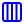
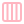
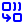
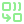

# Full Icon Catalog - Page 14

[<< Previous](ALL_ICONS_13.md) | Page 14 of 40 | [Next >>](ALL_ICONS_15.md)

| Name | Dark Mode | Light Mode | Red | Green | Blue | Orange | Pink | Gold | Yellow | Gray | Light Blue | Light Red | Light Green | Light Pink |
| :--- | :---: | :---: | :---: | :---: | :---: | :---: | :---: | :---: | :---: | :---: | :---: | :---: | :---: | :---: |
| `cloud-drizzle` |  |  |  |  |  |  |  |  |  |  |  |  |  |  |
| `cloud-hail` |  |  |  |  |  |  |  |  |  |  |  |  |  |  |
| `cloud-moon` |  |  |  |  |  |  |  |  |  |  |  |  |  |  |
| `cloud-off` |  |  |  |  |  |  |  |  |  |  |  |  |  |  |
| `cloud-rain-wind` |  |  |  |  |  |  |  |  |  |  |  |  |  |  |
| `cloud-sun` |  |  |  |  |  |  |  |  |  |  |  |  |  |  |
| `cloud-sync` |  |  |  |  |  |  |  |  |  |  |  |  |  |  |
| `cloud` |  |  |  |  |  |  |  |  |  |  |  |  |  |  |
| `cloudy` |  |  |  |  |  |  |  |  |  |  |  |  |  |  |
| `club` |  |  |  |  |  |  |  |  |  |  |  |  |  |  |
| `code-xml` |  |  |  |  |  |  |  |  |  |  |  |  |  |  |
| `code2` |  |  |  |  |  |  |  |  |  |  |  |  |  |  |
| `cog` |  |  |  |  |  |  |  |  |  |  |  |  |  |  |
| `columns` |  |  |  |  |  |  |  |  |  |  |  |  |  |  |
| `columns3` |  |  |  |  |  |  |  |  |  |  |  |  |  |  |
| `columns4` |  |  |  |  |  |  |  |  |  |  |  |  |  |  |
| `combine` |  |  |  |  |  |  |  |  |  |  |  |  |  |  |
| `compass` |  |  |  |  |  |  |  |  |  |  |  |  |  |  |
| `computer` |  |  |  |  |  |  |  |  |  |  |  |  |  |  |
| `cone` |  |  |  |  |  |  |  |  |  |  |  |  |  |  |

[<< Previous](ALL_ICONS_13.md) | Page 14 of 40 | [Next >>](ALL_ICONS_15.md)
