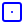
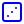
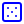
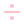
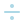
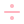

# Full Icon Catalog - Page 16

[<< Previous](ALL_ICONS_15.md) | Page 16 of 40 | [Next >>](ALL_ICONS_17.md)

| Name | Dark Mode | Light Mode | Red | Green | Blue | Orange | Pink | Gold | Yellow | Gray | Light Blue | Light Red | Light Green | Light Pink |
| :--- | :---: | :---: | :---: | :---: | :---: | :---: | :---: | :---: | :---: | :---: | :---: | :---: | :---: | :---: |
| `database-arrow-down` |  |  |  |  |  |  |  |  |  |  |  |  |  |  |
| `database-backup` |  |  |  |  |  |  |  |  |  |  |  |  |  |  |
| `database-minus` |  |  |  |  |  |  |  |  |  |  |  |  |  |  |
| `database-search` |  |  |  |  |  |  |  |  |  |  |  |  |  |  |
| `database-zap` |  |  |  |  |  |  |  |  |  |  |  |  |  |  |
| `database` |  |  |  |  |  |  |  |  |  |  |  |  |  |  |
| `decimals-arrow-right` |  |  |  |  |  |  |  |  |  |  |  |  |  |  |
| `dessert` |  |  |  |  |  |  |  |  |  |  |  |  |  |  |
| `diamond-percent` |  |  |  |  |  |  |  |  |  |  |  |  |  |  |
| `diamond` |  |  |  |  |  |  |  |  |  |  |  |  |  |  |
| `dice1` |  |  |  |  |  |  |  |  |  |  |  |  |  |  |
| `dice3` |  |  |  |  |  |  |  |  |  |  |  |  |  |  |
| `dice5` |  |  |  |  |  |  |  |  |  |  |  |  |  |  |
| `dices` |  |  |  |  |  |  |  |  |  |  |  |  |  |  |
| `disc` |  |  |  |  |  |  |  |  |  |  |  |  |  |  |
| `disc3` |  |  |  |  |  |  |  |  |  |  |  |  |  |  |
| `divide-square` |  |  |  |  |  |  |  |  |  |  |  |  |  |  |
| `divide` |  |  |  |  |  |  |  |  |  |  |  |  |  |  |
| `dna-off` |  |  |  |  |  |  |  |  |  |  |  |  |  |  |
| `dog` |  |  |  |  |  |  |  |  |  |  |  |  |  |  |

[<< Previous](ALL_ICONS_15.md) | Page 16 of 40 | [Next >>](ALL_ICONS_17.md)
