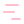

# Full Icon Catalog - Page 21

[<< Previous](ALL_ICONS_20.md) | Page 21 of 40 | [Next >>](ALL_ICONS_22.md)

| Name | Dark Mode | Light Mode | Red | Green | Blue | Orange | Pink | Gold | Yellow | Gray | Light Blue | Light Red | Light Green | Light Pink |
| :--- | :---: | :---: | :---: | :---: | :---: | :---: | :---: | :---: | :---: | :---: | :---: | :---: | :---: | :---: |
| `chart-no-axes-column-decreasing` |  |  |  |  |  |  |  |  |  |  |  |  |  |  |
| `chart-no-axes-column-increasing` |  |  |  |  |  |  |  |  |  |  |  |  |  |  |
| `chart-no-axes-column` |  |  |  |  |  |  |  |  |  |  |  |  |  |  |
| `chart-no-axes-combined` |  |  |  |  |  |  |  |  |  |  |  |  |  |  |
| `chart-no-axes-gantt` |  |  |  |  |  |  |  |  |  |  |  |  |  |  |
| `chart-pie` |  |  |  |  |  |  |  |  |  |  |  |  |  |  |
| `chart-scatter` |  |  |  |  |  |  |  |  |  |  |  |  |  |  |
| `chart-spline` |  |  |  |  |  |  |  |  |  |  |  |  |  |  |
| `check-check` |  |  |  |  |  |  |  |  |  |  |  |  |  |  |
| `check-circle` |  |  |  |  |  |  |  |  |  |  |  |  |  |  |
| `check-circle2` |  |  |  |  |  |  |  |  |  |  |  |  |  |  |
| `check-line` |  |  |  |  |  |  |  |  |  |  |  |  |  |  |
| `check-minus` |  |  |  |  |  |  |  |  |  |  |  |  |  |  |
| `check-plus` |  |  |  |  |  |  |  |  |  |  |  |  |  |  |
| `check-square` |  |  |  |  |  |  |  |  |  |  |  |  |  |  |
| `check-square2` |  |  |  |  |  |  |  |  |  |  |  |  |  |  |
| `check-x` |  |  |  |  |  |  |  |  |  |  |  |  |  |  |
| `check` |  |  |  |  |  |  |  |  |  |  |  |  |  |  |
| `chef-hat` |  |  |  |  |  |  |  |  |  |  |  |  |  |  |
| `cherry` |  |  |  |  |  |  |  |  |  |  |  |  |  |  |

[<< Previous](ALL_ICONS_20.md) | Page 21 of 40 | [Next >>](ALL_ICONS_22.md)
