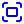
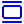
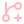

# Full Icon Catalog - Page 22

[<< Previous](ALL_ICONS_21.md) | Page 22 of 40 | [Next >>](ALL_ICONS_23.md)

| Name | Dark Mode | Light Mode | Red | Green | Blue | Orange | Pink | Gold | Yellow | Gray | Light Blue | Light Red | Light Green | Light Pink |
| :--- | :---: | :---: | :---: | :---: | :---: | :---: | :---: | :---: | :---: | :---: | :---: | :---: | :---: | :---: |
| `folder-x` |  |  |  |  |  |  |  |  |  |  |  |  |  |  |
| `folder` |  |  |  |  |  |  |  |  |  |  |  |  |  |  |
| `footprints` |  |  |  |  |  |  |  |  |  |  |  |  |  |  |
| `fork-knife-crossed` |  |  |  |  |  |  |  |  |  |  |  |  |  |  |
| `form` |  |  |  |  |  |  |  |  |  |  |  |  |  |  |
| `forward` |  |  |  |  |  |  |  |  |  |  |  |  |  |  |
| `frown` |  |  |  |  |  |  |  |  |  |  |  |  |  |  |
| `fullscreen` |  |  |  |  |  |  |  |  |  |  |  |  |  |  |
| `funnel-x` |  |  |  |  |  |  |  |  |  |  |  |  |  |  |
| `funnel` |  |  |  |  |  |  |  |  |  |  |  |  |  |  |
| `gallery-horizontal-end` |  |  |  |  |  |  |  |  |  |  |  |  |  |  |
| `gallery-vertical` |  |  |  |  |  |  |  |  |  |  |  |  |  |  |
| `gamepad-directional` |  |  |  |  |  |  |  |  |  |  |  |  |  |  |
| `gamepad` |  |  |  |  |  |  |  |  |  |  |  |  |  |  |
| `gantt-chart-square` |  |  |  |  |  |  |  |  |  |  |  |  |  |  |
| `gauge-circle` |  |  |  |  |  |  |  |  |  |  |  |  |  |  |
| `gem` |  |  |  |  |  |  |  |  |  |  |  |  |  |  |
| `ghost` |  |  |  |  |  |  |  |  |  |  |  |  |  |  |
| `git-branch-plus` |  |  |  |  |  |  |  |  |  |  |  |  |  |  |
| `git-branch` |  |  |  |  |  |  |  |  |  |  |  |  |  |  |

[<< Previous](ALL_ICONS_21.md) | Page 22 of 40 | [Next >>](ALL_ICONS_23.md)
