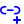

# Full Icon Catalog - Page 32

[<< Previous](ALL_ICONS_31.md) | Page 32 of 40 | [Next >>](ALL_ICONS_33.md)

| Name | Dark Mode | Light Mode | Red | Green | Blue | Orange | Pink | Gold | Yellow | Gray | Light Blue | Light Red | Light Green | Light Pink |
| :--- | :---: | :---: | :---: | :---: | :---: | :---: | :---: | :---: | :---: | :---: | :---: | :---: | :---: | :---: |
| `image-minus` |  |  |  |  |  |  |  |  |  |  |  |  |  |  |
| `image-plus` |  |  |  |  |  |  |  |  |  |  |  |  |  |  |
| `image-x` |  |  |  |  |  |  |  |  |  |  |  |  |  |  |
| `image` |  |  |  |  |  |  |  |  |  |  |  |  |  |  |
| `leaf` |  |  |  |  |  |  |  |  |  |  |  |  |  |  |
| `lightning-check` |  |  |  |  |  |  |  |  |  |  |  |  |  |  |
| `lightning-circle` |  |  |  |  |  |  |  |  |  |  |  |  |  |  |
| `lightning-minus` |  |  |  |  |  |  |  |  |  |  |  |  |  |  |
| `lightning-plus` |  |  |  |  |  |  |  |  |  |  |  |  |  |  |
| `lightning-x` |  |  |  |  |  |  |  |  |  |  |  |  |  |  |
| `lightning` |  |  |  |  |  |  |  |  |  |  |  |  |  |  |
| `link-check` |  |  |  |  |  |  |  |  |  |  |  |  |  |  |
| `link-circle` |  |  |  |  |  |  |  |  |  |  |  |  |  |  |
| `link-minus` |  |  |  |  |  |  |  |  |  |  |  |  |  |  |
| `link-plus` |  |  |  |  |  |  |  |  |  |  |  |  |  |  |
| `link-x` |  |  |  |  |  |  |  |  |  |  |  |  |  |  |
| `link` |  |  |  |  |  |  |  |  |  |  |  |  |  |  |
| `lock-check` |  |  |  |  |  |  |  |  |  |  |  |  |  |  |
| `lock-circle` |  |  |  |  |  |  |  |  |  |  |  |  |  |  |
| `lock-minus` |  |  |  |  |  |  |  |  |  |  |  |  |  |  |

[<< Previous](ALL_ICONS_31.md) | Page 32 of 40 | [Next >>](ALL_ICONS_33.md)
