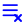
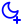

# Full Icon Catalog - Page 34

[<< Previous](ALL_ICONS_33.md) | Page 34 of 40 | [Next >>](ALL_ICONS_35.md)

| Name | Dark Mode | Light Mode | Red | Green | Blue | Orange | Pink | Gold | Yellow | Gray | Light Blue | Light Red | Light Green | Light Pink |
| :--- | :---: | :---: | :---: | :---: | :---: | :---: | :---: | :---: | :---: | :---: | :---: | :---: | :---: | :---: |
| `menu-x` |  |  |  |  |  |  |  |  |  |  |  |  |  |  |
| `menu` |  |  |  |  |  |  |  |  |  |  |  |  |  |  |
| `mic-check` |  |  |  |  |  |  |  |  |  |  |  |  |  |  |
| `mic-circle` |  |  |  |  |  |  |  |  |  |  |  |  |  |  |
| `mic-minus` |  |  |  |  |  |  |  |  |  |  |  |  |  |  |
| `mic-plus` |  |  |  |  |  |  |  |  |  |  |  |  |  |  |
| `mic-x` |  |  |  |  |  |  |  |  |  |  |  |  |  |  |
| `mic` |  |  |  |  |  |  |  |  |  |  |  |  |  |  |
| `microchip` |  |  |  |  |  |  |  |  |  |  |  |  |  |  |
| `monitor-check` |  |  |  |  |  |  |  |  |  |  |  |  |  |  |
| `monitor-circle` |  |  |  |  |  |  |  |  |  |  |  |  |  |  |
| `monitor-minus` |  |  |  |  |  |  |  |  |  |  |  |  |  |  |
| `monitor-plus` |  |  |  |  |  |  |  |  |  |  |  |  |  |  |
| `monitor-x` |  |  |  |  |  |  |  |  |  |  |  |  |  |  |
| `monitor` |  |  |  |  |  |  |  |  |  |  |  |  |  |  |
| `moon-check` |  |  |  |  |  |  |  |  |  |  |  |  |  |  |
| `moon-circle` |  |  |  |  |  |  |  |  |  |  |  |  |  |  |
| `moon-minus` |  |  |  |  |  |  |  |  |  |  |  |  |  |  |
| `moon-plus` |  |  |  |  |  |  |  |  |  |  |  |  |  |  |
| `moon-x` |  |  |  |  |  |  |  |  |  |  |  |  |  |  |

[<< Previous](ALL_ICONS_33.md) | Page 34 of 40 | [Next >>](ALL_ICONS_35.md)
