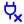

# Full Icon Catalog - Page 35

[<< Previous](ALL_ICONS_34.md) | Page 35 of 40 | [Next >>](ALL_ICONS_36.md)

| Name | Dark Mode | Light Mode | Red | Green | Blue | Orange | Pink | Gold | Yellow | Gray | Light Blue | Light Red | Light Green | Light Pink |
| :--- | :---: | :---: | :---: | :---: | :---: | :---: | :---: | :---: | :---: | :---: | :---: | :---: | :---: | :---: |
| `moon` |  |  |  |  |  |  |  |  |  |  |  |  |  |  |
| `music-check` |  |  |  |  |  |  |  |  |  |  |  |  |  |  |
| `music-circle` |  |  |  |  |  |  |  |  |  |  |  |  |  |  |
| `music-minus` |  |  |  |  |  |  |  |  |  |  |  |  |  |  |
| `music-plus` |  |  |  |  |  |  |  |  |  |  |  |  |  |  |
| `music-x` |  |  |  |  |  |  |  |  |  |  |  |  |  |  |
| `music` |  |  |  |  |  |  |  |  |  |  |  |  |  |  |
| `network` |  |  |  |  |  |  |  |  |  |  |  |  |  |  |
| `phone-check` |  |  |  |  |  |  |  |  |  |  |  |  |  |  |
| `phone-circle` |  |  |  |  |  |  |  |  |  |  |  |  |  |  |
| `phone-minus` |  |  |  |  |  |  |  |  |  |  |  |  |  |  |
| `phone-plus` |  |  |  |  |  |  |  |  |  |  |  |  |  |  |
| `phone-x` |  |  |  |  |  |  |  |  |  |  |  |  |  |  |
| `phone` |  |  |  |  |  |  |  |  |  |  |  |  |  |  |
| `plug-check` |  |  |  |  |  |  |  |  |  |  |  |  |  |  |
| `plug-circle` |  |  |  |  |  |  |  |  |  |  |  |  |  |  |
| `plug-minus` |  |  |  |  |  |  |  |  |  |  |  |  |  |  |
| `plug-plus` |  |  |  |  |  |  |  |  |  |  |  |  |  |  |
| `plug-x` |  |  |  |  |  |  |  |  |  |  |  |  |  |  |
| `plug` |  |  |  |  |  |  |  |  |  |  |  |  |  |  |

[<< Previous](ALL_ICONS_34.md) | Page 35 of 40 | [Next >>](ALL_ICONS_36.md)
