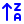

# Full Icon Catalog - Page 4

[<< Previous](ALL_ICONS_3.md) | Page 4 of 40 | [Next >>](ALL_ICONS_5.md)

| Name | Dark Mode | Light Mode | Red | Green | Blue | Orange | Pink | Gold | Yellow | Gray | Light Blue | Light Red | Light Green | Light Pink |
| :--- | :---: | :---: | :---: | :---: | :---: | :---: | :---: | :---: | :---: | :---: | :---: | :---: | :---: | :---: |
| `arrow-up-narrow-wide` |  |  |  |  |  |  |  |  |  |  |  |  |  |  |
| `arrow-up-right-from-circle` |  |  |  |  |  |  |  |  |  |  |  |  |  |  |
| `arrow-up-right-square` |  |  |  |  |  |  |  |  |  |  |  |  |  |  |
| `arrow-up-to-line` |  |  |  |  |  |  |  |  |  |  |  |  |  |  |
| `arrow-up-za` |  |  |  |  |  |  |  |  |  |  |  |  |  |  |
| `arrow-up01` |  |  |  |  |  |  |  |  |  |  |  |  |  |  |
| `arrows-up-from-line` |  |  |  |  |  |  |  |  |  |  |  |  |  |  |
| `asterisk-square` |  |  |  |  |  |  |  |  |  |  |  |  |  |  |
| `at-sign` |  |  |  |  |  |  |  |  |  |  |  |  |  |  |
| `audio-lines` |  |  |  |  |  |  |  |  |  |  |  |  |  |  |
| `award` |  |  |  |  |  |  |  |  |  |  |  |  |  |  |
| `axis3-d` |  |  |  |  |  |  |  |  |  |  |  |  |  |  |
| `baby` |  |  |  |  |  |  |  |  |  |  |  |  |  |  |
| `badge-cent` |  |  |  |  |  |  |  |  |  |  |  |  |  |  |
| `badge-dollar-sign` |  |  |  |  |  |  |  |  |  |  |  |  |  |  |
| `badge-help` |  |  |  |  |  |  |  |  |  |  |  |  |  |  |
| `badge-info` |  |  |  |  |  |  |  |  |  |  |  |  |  |  |
| `badge-minus` |  |  |  |  |  |  |  |  |  |  |  |  |  |  |
| `badge-plus` |  |  |  |  |  |  |  |  |  |  |  |  |  |  |
| `badge-question-mark` |  |  |  |  |  |  |  |  |  |  |  |  |  |  |

[<< Previous](ALL_ICONS_3.md) | Page 4 of 40 | [Next >>](ALL_ICONS_5.md)
